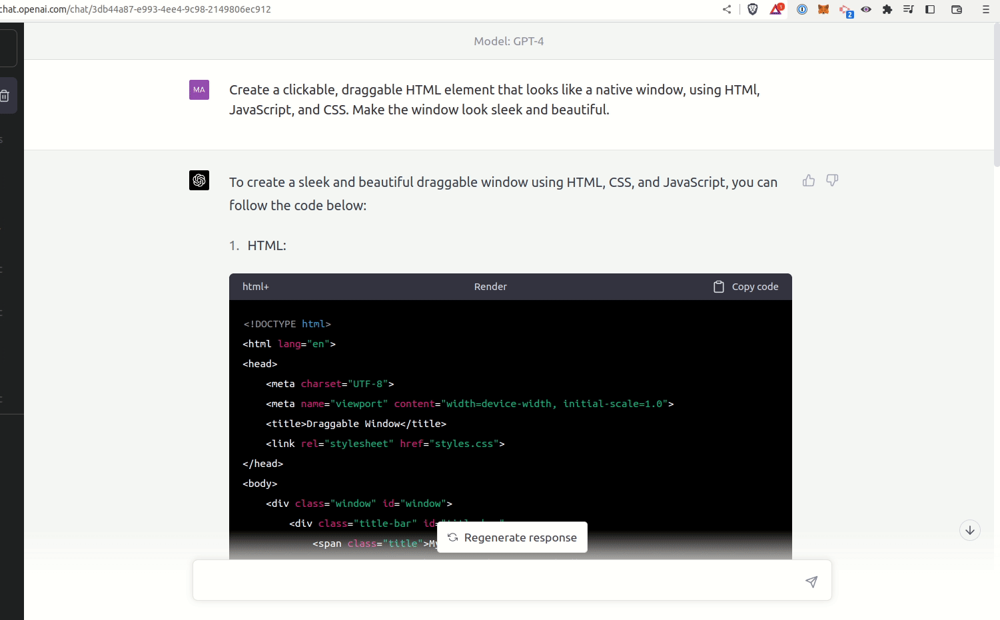
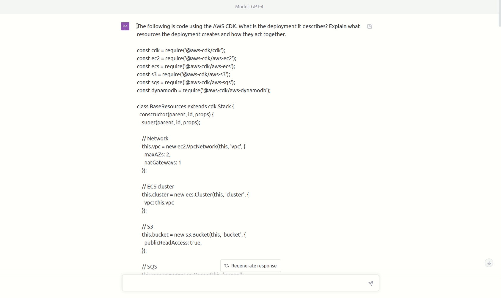

# rendergpt

A Chrome extension to render HTML/JavaScript/CSS from ChatGPT into iframes.

**Status**: experimental.

The extension just adds a "render" button to any HTML or PlantUML code blocks in 
a ChatGPT conversation.

Clicking the button renders the HTML in an iframe, and allows selecting other
code blocks (JavaScript, CSS) from the conversation for inclusion, mixing and 
matching sources.

## Installation

1. Go to the releases page, download the latest `rendergpt.*.zip` file, and extract it.
2. Open Chrome/Brave and navigate to `chrome://extensions`.
3. Enable "Developer mode" in the top right.
4. Click "Load unpacked" and select the `public/` directory of this repository.

## Examples

ChatGPT does pretty well with structured output. I've had success getting it to
build diagrams with PlantUML syntax, draw SVGs of varying complexity, and of
course compose HTMl, CSS, and JavaScript.

Writing some interactive JavaScript:

Generating a PlantUML diagram from source code:

## Ideas 

- [x] Render HTML/CSS/JavaScript in an iframe inside the conversation
- [x] Allow mixing and matching different code blocks from the conversation
- [x] Render PlantUML diagrams. I've been copy-and-pasting ChatGPT output into
  [plantuml.com's web app](http://www.plantuml.com/plantuml/uml/SyfFKj2rKt3CoKnELR1Io4ZDoSa70000)
  and honestly it does a decent job. Certainly useful as a first pass.
- [ ] Sometimes it takes a long time for it to re-stream an entire code block 
  when you've only asked it to make a small modification. It'd be cool if you
  could **instruct it to respond with a git patch**, and then have the extension 
  apply the patch for you.
- [ ] Render ClojureScript / Reagent components as well (perhaps via Scittle?)
- [ ] Render plots. Ofc this can be done via JS, but depending on its ability to
  fetch tabular data, it might be nice to be able to toggle a plot view.

## Development

**First**, build the extension in development mode with the dev Babashka task:

    $ bb dev

Or equivalently, via npm, `npx shadow-cljs watch :app`.

**Second**, load the public/ directory as an unpacked extension in Chrome/Brave.

**Finally**, start a ChatGPT conversation. The "render" button only appears 
for code blocks tagged "html" for now. 

For some reason, ChatGPT sometimes tags HTML as "php" and requires a gentle 
reminder that we no longer use that technology by choice.
